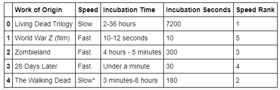
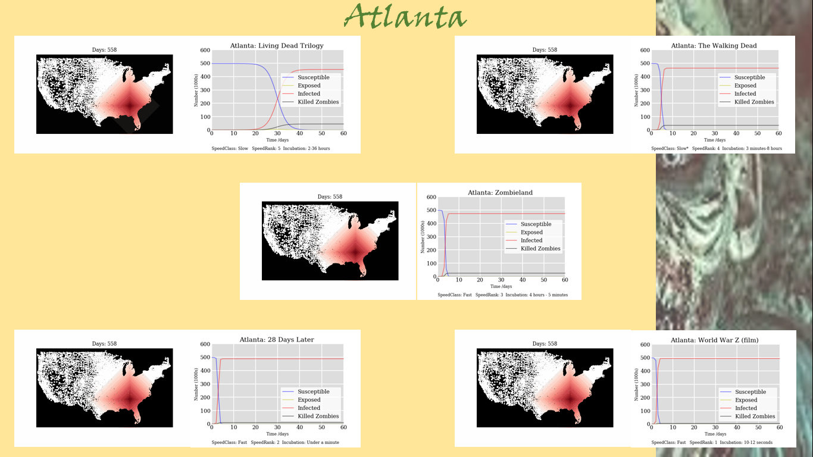
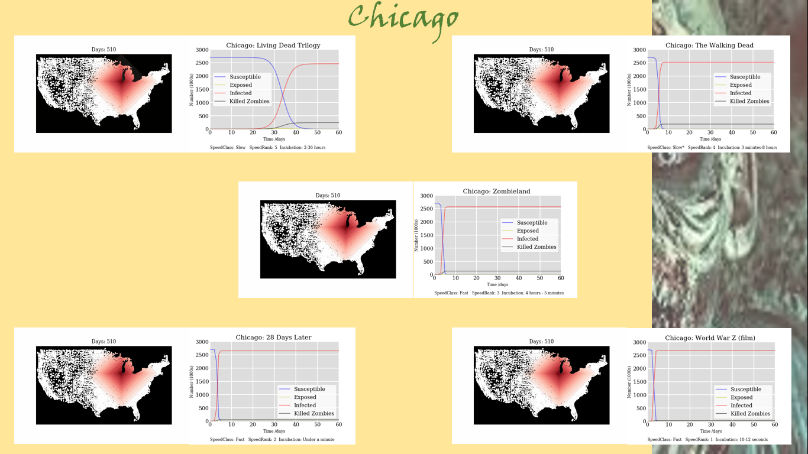
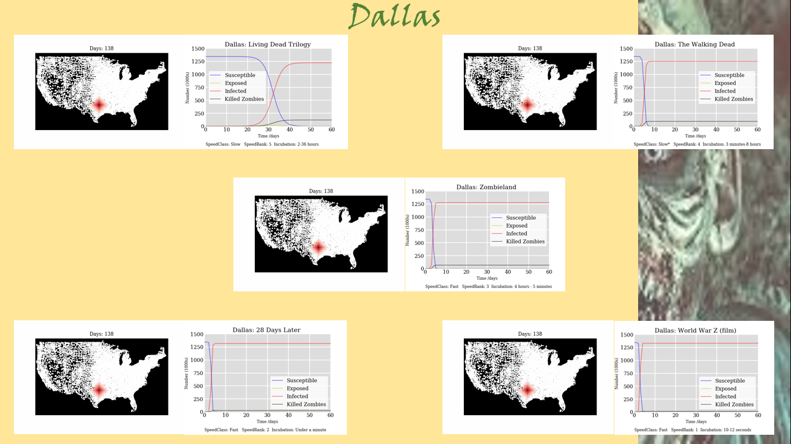
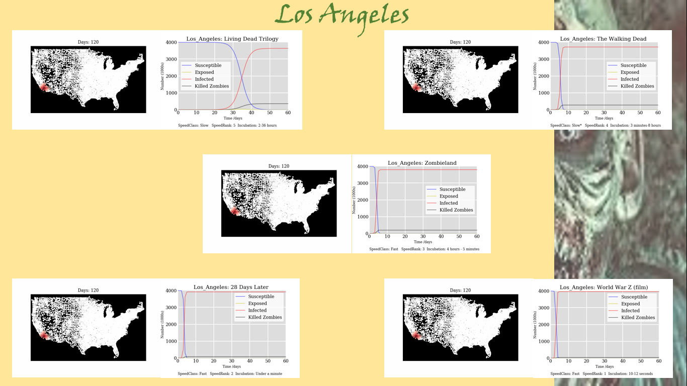

# Zombie Apocolypse
#[]()


<!-- TABLE OF CONTENTS -->
## Table of Contents

* [Team Zombie](#team-zombie)
* [Purpose of the Analysis](#purpose-of-the-analysis)
* [Methodology](#methodology)
* [Key Documents](#key-documents)
* [Findings](#findings)
* [Coding Style](#coding-style)
* [Coding Documentation](#coding-documentation)
* [API Calls](#API-calls)
* [Authors](#authors)
* [Acknowledgments](#acknowledgments)


# Team Zombie

Team Zombie found inspiration  for this project at the website: http://maxberggren.se/2014/11/27/model-of-a-zombie-outbreak/.  This website projects the spread of a hypothetically zombie outbreak that starts from a location in Sweden, Norway and Finland.  A similar concept was used to model a zombie outbreak in the United States.  

Different viruses spread at different rates so we will use different infection rates evaluate the spread of the infections starting from our selected cities:  New York, Atlanta, Dallas, Chicago and Los Angeles.  We chose these cities because they are major cities with a significant population that are in different regions across the United States and would be a good representation for the country.

We used information from the Center of Disease Control and Prevention (https://wwwn.cdc.gov/norsdashboard/) to gather information the number of person-to-person outbreaks and the percentage of the population that gets regular check ups with the intent to see how this information would factor in to our outbreak spread.  After evaluating the k-means result, we found this information not to be a significant factor in relation to how the virus spread and decided to focus on population and density instead.  

There are five movies that we selected to represent the spread of the outbreak across the US.  Using information from https://zombie.fandom.com/wiki/Zombie_Comparison_Chart, we found outbreak spead for our five movies and then ordered them outbreak speed to fastest (1-Living Dead Trilogy, 2-The Walking Dead,3-Zombieland,4-28 Days Later,5-World War Z (film)).  The user will be prompted to choose a movie(representing the speed of the outbreak) and city which will then produce an animation of how the outbreak would be projected to spread with those given parameters.  


## Purpose of the Analysis

The purpose is to determine the rate of which a virus(zombie outbreak) spreads within the US.  We focused our research on only human-to-human contact viruses and used variables such as outbreak speed, incubation time, population and population density determine the expected spread of the outbreak based on our predictive analysis. 


## Visualizations

The following data sets were used throughout the project.

### Movie Information Table
[]()


### Outbreak Spread by City

[]()


[]()


[]()


[]()


[]()


### SEIR Model


## Findings


## Next steps


## Coding Style

Javascript programming language was used.

Python programming language was used, the list of dependencies are as follows:

```sh

import requests
import pandas as pd
from pprint import pprint
import time
import json
import csv
import math
import numpy

```


## Authors

Silvana Murphy- Initial Work - [SMU Team Zombie - Project 3](https://github.com/SSMDFW)

Lori Brady - Initial Work - [SMU Team Zombie - Project 3](https://github.com/loribeth18)

Mabel Gutierrez- Initial Work - [SMU Team Zombie - Project 3](https://github.com/mabel912)

Velindia Lucas - Initial Work - [SMU Team Zombie - Project 3](https://github.com/chele0630)

